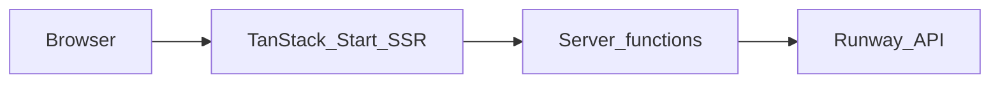

# Brainway

For product positioning, public **roadmap**, **collaborations**, and **ecosystem** narrative (Hermes, ElizaOS, ElevenLabs as a comparison point for agent distribution), see the **[root `README.md`](../README.md)** in this monorepo.

Brainway is a web application for turning learning materials into calm, sensory-aware experiences. It targets neurodivergent learners (for example ADHD and autistic audiences) with toned-down motion, profile-driven accessibility settings, and tooling built around [Runway](https://runwayml.com/) video and Characters APIs.

The product blends a marketing landing page, an AI-assisted **transform** studio, an **educator create** flow for short educational clips, optional **live** avatar sessions, and a **community** surface for sharing neurodivergent-friendly resources.

---

## Table of contents

- [Architecture](#architecture)
- [Tech stack](#tech-stack)
- [Repository layout](#repository-layout)
- [Features and routes](#features-and-routes)
- [Getting started](#getting-started)
- [Environment variables](#environment-variables)
- [Scripts](#scripts)
- [Routing and generated files](#routing-and-generated-files)
- [Deployment (Cloudflare)](#deployment-cloudflare)
- [Branches and contribution flow](#branches-and-contribution-flow)

---

## Architecture

Brainway uses [TanStack Start](https://tanstack.com/start) on [Vite](https://vitejs.dev/): React renders on both client and server, and **server functions** (`createServerFn` from `@tanstack/react-start`) run API-style logic alongside the UI without a separate REST service for most features.

Rough request flow:



Heavy lifting (video tasks, Characters realtime sessions, uploads) is delegated to Runway using an org-scoped API secret. The [`@runwayml/sdk`](https://www.npmjs.com/package/@runwayml/sdk) client and bespoke `fetch` calls in [`src/lib/runway-api.ts`](src/lib/runway-api.ts) coexist; base URL helpers live in [`src/lib/runway-config.ts`](src/lib/runway-config.ts) to avoid double `/v1` paths with the SDK.

---

## Tech stack

| Layer | Choices |
|--------|---------|
| UI | React 19, [Motion](https://motion.dev/), [Radix UI](https://www.radix-ui.com/), [Tailwind CSS](https://tailwindcss.com/) v4 ([`@tailwindcss/vite`](https://tailwindcss.com/docs/installation/using-vite)), [Phosphor Icons](https://phosphoricons.com/) |
| App framework | TanStack Router, TanStack Query, TanStack Start |
| Bundler | Vite 7 |
| Types | TypeScript (strict), Zod validators on server-fn inputs |
| Edge | Cloudflare Workers entry via [`wrangler.jsonc`](wrangler.jsonc) and `@cloudflare/vite-plugin` (production build path) |

---

## Repository layout

**Brainway** (this web app) lives in the **`Brainway/`** directory of the monorepo (`src/`, `public/`, `package.json`, Vite and Wrangler config). Other top-level paths include docs, plugins, and optional services:

| Path | Role |
|------|------|
| **`Brainway/`** (`src/`, `public/`, config files) | Brainway TanStack Start application |
| [`docs/`](docs/README.md) | Documentation index and future guides |
| [`plugins/runway/`](plugins/runway/README.md) | Hermes (Python) Runway plugin |
| [`plugins/plugin-runway/`](plugins/plugin-runway/README.md) | ElizaOS Runway plugin (`@elizaos/core`) |
| [`recall-bridge/`](../recall-bridge/README.md) | Node service (Recall.ai + Runway) so a Character can join Zoom / Meet / Teams as a participant — pair with `RECALL_BRIDGE_URL` in Brainway |

### Application source (`Brainway/`)

| Path | Role |
|------|------|
| [`src/routes/`](src/routes/) | File-based routes (`createFileRoute`); each file is a top-level segment like `/live`, `/transform` |
| [`src/routeTree.gen.ts`](src/routeTree.gen.ts) | Generated TanStack Router route tree (**do not hand-edit for new routes**; regenerate via dev/build tooling) |
| [`src/components/`](src/components/) | Shared UI, marketing sections, transform widgets, live session shell |
| [`src/lib/`](src/lib/) | Runway integrations, educator generation, neurosafe stubs, transforms, Characters session helpers |
| [`src/start.ts`](src/start.ts) | Start instance (e.g. error middleware) |
| [`src/server.ts`](src/server.ts) | Cloudflare-compatible server entry forwarding to TanStack Start |
| [`vite.config.ts`](vite.config.ts) | Vite plugins: TanStack Start, React, tsconfig paths, Tailwind; Cloudflare plugin in production builds |
| [`wrangler.jsonc`](wrangler.jsonc) | Worker name, compatibility flags (`nodejs_compat`), entry module |

---

## Features and routes

The following reflects the fuller application surface (see [Branches](#branches-and-contribution-flow) if your local `main` branch does not yet include every route).

| Route | Purpose |
|-------|---------|
| `/` | Landing: hero, sponsor ticker, feature highlights, **live meeting** ([`LiveMeetingSection`](src/components/LiveMeetingSection.tsx)), **roadmap** ([`RoadmapSection`](src/components/RoadmapSection.tsx)), **ecosystem** ([`EcosystemSection`](src/components/EcosystemSection.tsx)), **collaborations** ([`CollaborationsSection`](src/components/CollaborationsSection.tsx)), use modes, problem, how-it-works, audience, CTA, footer |
| `/transform` | Studio for transforming existing media (profiles, uploads, Runway-backed tasks — see [`src/lib/transform-fns.ts`](src/lib/transform-fns.ts)) |
| `/create` | Educator-oriented Gen-4.5 text/image-to-video flow ([`src/routes/create.tsx`](src/routes/create.tsx)) |
| `/live` | Runway **Characters** realtime session UI ([`@runwayml/avatars-react`](src/routes/live.tsx)) |
| `/meet` | Guided flow: learner profiles → **paste Zoom / Meet / Teams URL** → pick preset or custom Character → **Send Character to Meeting** via Recall.ai ([`recall-meet-fns.ts`](src/lib/recall-meet-fns.ts)) when [`recall-bridge/`](../recall-bridge/README.md) is deployed and `RECALL_BRIDGE_URL` is set; optional **Preview in browser** uses the same Characters session as `/live` ([`meet.tsx`](src/routes/meet.tsx)). Query: `?profiles=adhd,sensory`. Full personality PATCH + prompts apply to **custom** avatars on the bridge path (presets log a note). |
| `/community` | Community “neurosafe” library UX backed by server functions ([`src/lib/neurosafe-fns.ts`](src/lib/neurosafe-fns.ts); in-memory seeded data unless you extend it) |

Neurodivergent-facing options (profiles, pacing, language for live sessions, etc.) are threaded through [`ProfileSelector`](src/components/transform/ProfileSelector.tsx), [`TransformConfig`](src/components/transform/TransformConfig.tsx), and Character personality builders in [`src/lib/character-personality.ts`](src/lib/character-personality.ts).

---

## Getting started

### Prerequisites

- **Node.js** 20+ recommended (aligned with modern Vite/React toolchains).
- npm (uses [`package-lock.json`](package-lock.json)).

### Install and run

```bash
npm install
npm run dev
```

Development runs Vite with TanStack Start; open the URL printed in the terminal (typically `http://localhost:5173`).

### Runway API secret

Most server functions require `RUNWAYML_API_SECRET`. Without it, calls that invoke [`getRunwayApiSecret()`](src/lib/runway-config.ts) will fail fast with a configuration error.

Create `.env.local` (or `.env`) in the project root — Vite/`react-start` will load standard env files locally:

```bash
RUNWAYML_API_SECRET=your_key_here
```

Optional overrides are documented below.

---

## Environment variables

| Variable | Required | Description |
|-----------|----------|-------------|
| `RUNWAYML_API_SECRET` | **Yes** for video/Characters features | Org API secret from the Runway developer portal (trimmed on read). |
| `RUNWAYML_API_BASE_URL` | No | API base ending in `/v1`, e.g. `https://api.dev.runwayml.com/v1`. |
| `RUNWAYML_BASE_URL` | No | Alias for SDK parity; origin-only values get `/v1` appended automatically. |
| `RUNWAY_CHARACTER_AVATAR_ID` | No | Default avatar id (`music-superstar` if unset). See [`character-fns.ts`](src/lib/character-fns.ts). |
| `RUNWAY_CHARACTER_AVATAR_TYPE` | No | `runway-preset` (default) or `custom`. Use **`custom`** together with a custom avatar id when you want multilingual and neurodivergent profile prompts from [`character-personality.ts`](src/lib/character-personality.ts) on `/live` and `/meet` browser preview. Preset avatars accept the session but keep Runway’s baked-in persona. |
| `RECALL_BRIDGE_URL` | No | **HTTPS origin** (no trailing slash) of the deployed [`recall-bridge`](../recall-bridge/README.md) Node app. Required for **Send Character to Meeting** on `/meet`. Brainway server functions proxy Runway calls with `RUNWAYML_API_SECRET`; the bridge holds your Recall.ai key and WebSocket video relay. |

For Cloudflare production, mirror these as Worker secrets / vars (same names). Local Worker builds may read from `.dev.vars` if you use Wrangler that way. For a quick local template, see [`.env.example`](.env.example).

---

## Scripts

| Command | Description |
|---------|--------------|
| `npm run dev` | Start TanStack Start + Vite in development |
| `npm run build` | Production build (client + SSR + `tanstack_start_app` bundle for Workers) |
| `npm run build:dev` | Vite production build with `development` mode |
| `npm run preview` | Preview the production client build locally |
| `npm run lint` | ESLint across the repo |
| `npm run format` | Prettier write pass |

---

## Routing and generated files

- Add or rename a file under [`src/routes/`](src/routes/) while the dev server (or codegen) runs so [`src/routeTree.gen.ts`](src/routeTree.gen.ts) stays aligned with TanStack Router’s file router.
- If `routeTree.gen.ts` diverges from the route files — for example importing a segment that does not exist — builds will fail; regenerate by running dev/build tooling rather than patching the generated file manually.

---

## Deployment (Cloudflare)

[`wrangler.jsonc`](wrangler.jsonc) points the Worker `main` at [`src/server.ts`](src/server.ts) and opts into `nodejs_compat`. The production Vite pipeline emits a **`tanstack_start_app`** artefact wired for Cloudflare; see [`vite.config.ts`](vite.config.ts) for when `@cloudflare/vite-plugin` activates.

Deploy with [Wrangler](https://developers.cloudflare.com/workers/wrangler/) (`wrangler deploy`) after configuring your account and supplying Runway secrets in the Worker environment. Exact CI/CD hooks are repo-specific — add secrets in the dashboard or your pipeline.

### Vercel

[`vite.config.ts`](vite.config.ts) enables **[Nitro](https://nitro.build/)** **`preset: "vercel"`** when **`BRAINWAY_VERCEL_DEPLOY=1`** (set by [`vercel.json`](vercel.json) via **`cross-env`**) or when **`VERCEL=1`** (needs **[Enable access to System Environment Variables](https://vercel.com/docs/projects/environment-variables/system-environment-variables)** if you rely on that alone). Nitro emits **`.vercel/output`** for SSR + static assets.

[`vercel.json`](vercel.json) sets **`installCommand`** and **`buildCommand`** — **do not** set **`outputDirectory`** to **`dist/client`** (no root **`index.html`** there).

1. Set **Root Directory** to **`Brainway`**.
2. Leave **Output Directory** empty (dashboard overrides **`vercel.json`**).
3. Optional: enable **system environment variables** so **`VERCEL=1`** exists during builds (`BRAINWAY_VERCEL_DEPLOY` in **`buildCommand`** already forces Nitro when system vars are off).

---

## Branches and contribution flow

Integration work may be staged across stacked branches rather than always on `main`:

1. **`feat_characters`** — Runway Characters live sessions, multilingual and related fixes  
2. **`chore/brainway-rebrand`** — Brand and hero asset alignment (legacy: `chore/brainwave-rebrand`)  
3. **`feat/community-neurosafe-library`** — Community neurosafe routes and server helpers  
4. **`feat/educator-create-transform`** — Create flow, transform pipeline expansion, `@runwayml/sdk`, route tree updates  

Open pull requests targeting the appropriate base (`main` vs the stacked parent) depending on merge order.

---

## Troubleshooting

- **“RUNWAYML_API_SECRET is not configured”** — Set the secret in `.env.local` / Worker env and restart the dev server.  
- **`/v1/v1/…` Runway URLs** — Use [`getRunwayApiOrigin()`](src/lib/runway-config.ts) for the SDK constructor and [`getRunwayApiBase()`](src/lib/runway-config.ts) for raw REST calls — they are not interchangeable.  
- **Characters realtime 400 discriminator errors** — Preset vs custom avatar payloads must match Runway API expectations (`runway-preset` + `presetId` vs `custom` + `avatarId`). See [`src/lib/runway-characters.ts`](src/lib/runway-characters.ts) and [`src/lib/character-fns.ts`](src/lib/character-fns.ts).  
- **`routeTree.gen.ts` mismatch** — Re-run codegen via dev/build; ensure every imported route file exists.
- **Vercel `404 NOT_FOUND`** — Clear **Output Directory** (must not be **`dist/client`**). Confirm deploy logs show Nitro (`Generated .vercel/output`). **`buildCommand`** forces **`BRAINWAY_VERCEL_DEPLOY=1`**. If you dropped **`cross-env`** or overridden **`buildCommand`**, Nitro may not run.

---

## License

No `LICENSE` file is present in this repository as of this README. Clarify licensing with the repository owner before redistribution.
