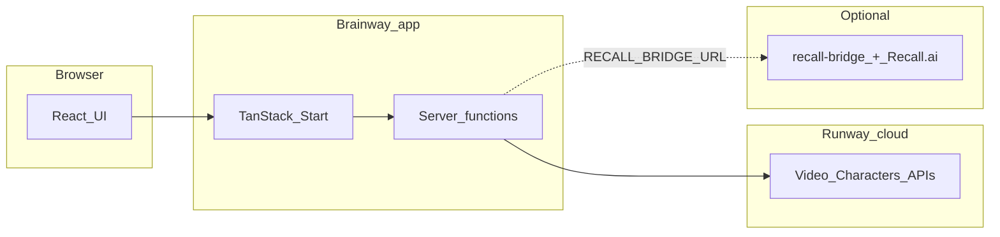

# Brainway

**Sensory-aware learning media for neurodivergent learners** — built as an open monorepo around [Runway](https://runwayml.com/) video and **Characters** APIs, with optional **Recall.ai** integration so an AI character can join live conferences.

This repository is a **monorepo**: the product web app lives under [`Brainway/`](Brainway/README.md), optional meeting infra under [`recall-bridge/`](recall-bridge/README.md), Mintlify-oriented docs under [`docs/`](docs/README.md), and Runway-related agent plugins under [`plugins/`](plugins/).

---

## Table of contents

- [What this project is](#what-this-project-is)
- [The problem we’re addressing](#the-problem-were-addressing)
- [Why Brainway exists](#why-brainway-exists)
- [Who can use it](#who-can-use-it)
- [What you can do with Brainway](#what-you-can-do-with-brainway)
- [How it works (high level)](#how-it-works-high-level)
- [Neurodivergent profiles and accessibility levers](#neurodivergent-profiles-and-accessibility-levers)
- [Repository layout](#repository-layout)
- [Getting started](#getting-started)
- [Environment variables (overview)](#environment-variables-overview)
- [Optional: Recall bridge and `/meet`](#optional-recall-bridge-and-meet)
- [Deployment](#deployment)
- [Documentation and deeper technical detail](#documentation-and-deeper-technical-detail)
- [Research, claims, and limitations](#research-claims-and-limitations)
- [Collaborations and cosigns](#collaborations-and-cosigns)
- [Ecosystem and developer tools](#ecosystem-and-developer-tools)
- [Roadmap and future plans](#roadmap-and-future-plans)
- [License](#license)

---

## What this project is

Brainway is a **full-stack web application** ([TanStack Start](https://tanstack.com/start) + React + Vite) that helps educators and learners produce and experience **calmer, more predictable audiovisual learning content**. It combines:

- **Generative video tooling** (short clips, transformations of existing media) driven by Runway APIs.
- **Profile-based accessibility constraints** (ADHD-, autism-, dyslexia-, and sensory-oriented presets and sliders) that shape prompts and UI configuration.
- **Realtime Runway Characters** for conversational / presenter-style sessions in the browser (`/live`).
- **Optional live-class integration**: send a Character into **Zoom / Google Meet / Microsoft Teams** via [Recall.ai](https://www.recall.ai/) and the [`recall-bridge`](recall-bridge/README.md) Node service (`/meet`).
- **Safe media tooling** for generating **sensory-conscious imagery** (`/safe-images`) and **soundscapes / ambient audio** (`/safe-audio`) aligned with neurodivergent-friendly goals.
- A **community-facing library surface** (`/community`) for sharing “neurosafe” style resources (currently backed by seeded/in-memory data unless you extend it).

The landing experience (`/`) explains the product positioning; **`/create`** and **`/transform`** are the core educator workflows for **creating new material** and **adapting existing lecture or media assets** toward calmer pacing and presentation.

---

## The problem we’re addressing

Many learners—especially **ADHD**, **autistic**, **dyslexic**, and **sensory-sensitive** audiences—experience **standard educational video** as overwhelming or inaccessible:

- **High sensory load**: flashing cuts, loud peaks, busy backgrounds, saturated colour, and chaotic motion can trigger overload or withdrawal.
- **Cognitive load**: dense on-screen text, fast pacing without structure, and unclear transitions make retention harder—particularly when working memory or language processing differs from “typical” lecture design.
- **Predictability**: abrupt scene changes without cues can be distressing for learners who rely on **consistent structure** and **advance signalling**.
- **One-size-fits-all tools**: most authoring stacks optimise for speed of production, not **profile-aware delivery**.

Brainway encodes **design hypotheses** (segmentation, softer transitions, optional narration-first layouts, desaturation, audio caps, dyslexia-oriented typography toggles, etc.) into **configurable profiles** and **server-side prompts**, so teams can aim for **gentler media** without manually re-editing every asset.

---

## Why Brainway exists

Brainway exists to **bridge neurodiversity-informed instructional design** with **modern generative media**:

1. **Reduce sensory and extraneous load** where tooling allows (colour, motion, audio shape, text density).
2. **Make accessibility constraints repeatable** via presets and sliders—not one-off manual edits.
3. **Support both async and live learning**: generated clips, transformed lectures, browser Characters, and optional bots in real conferences.
4. **Stay pragmatic about evidence**: many controls mirror cognitive-multimedia and ND-inclusive design literature, but **your deployment should validate outcomes** with real learners and practitioners (see [Research, claims, and limitations](#research-claims-and-limitations)).

---

## Who can use it

| Audience | How they might use Brainway |
|----------|-----------------------------|
| **Teachers & professors** | Generate short calm explainers (`/create`), turn existing recordings into softer variants (`/transform`), preview Characters (`/live`), optionally deploy `/meet` + Recall for hybrid classes. |
| **Therapists & clinicians** | Craft calm visual/audio assets (`/safe-images`, `/safe-audio`), structured video snippets with predictable pacing (profiles). |
| **Parents & homeschoolers** | Same as educators at smaller scale; depends on your Runway org access. |
| **Instructional designers & DEI/accessibility leads** | Pilot profile pipelines and compare outputs; extend prompts and profiles in code. |
| **Developers** | Fork the monorepo, deploy Brainway + optional `recall-bridge`, integrate plugins (`plugins/`), wire env/secrets. |

**Important:** Production use requires appropriate **API keys**, **privacy reviews**, and often **institutional approval** when working with minors or health-adjacent contexts.

---

## What you can do with Brainway

Concrete workflows the codebase supports today:

| Goal | Where in the app | Notes |
|------|------------------|--------|
| **Turn lecture or existing video into a calmer / profile-aware variant** | [`/transform`](Brainway/README.md#features-and-routes) | Upload media, choose ADHD / autism / dyslexia / sensory profiles, tune sliders; prompts steer Runway transforms. |
| **Create new short educational video from text/images** | [`/create`](Brainway/README.md#features-and-routes) | Educator-oriented Gen-4.5-style flow; pair with profile selection where relevant. |
| **Upload / produce sensory-conscious imagery** | `/safe-images` | Accessibility-oriented image generation flows (see route implementation). |
| **Design calmer ambient or masking audio** | `/safe-audio` | Soundscape-oriented tooling with ND-aware prompt scaffolding. |
| **Run a realtime AI Character session in the browser** | `/live` | Runway Characters + LiveKit; supports multilingual and preset/custom avatar modes (see `.env.example` for `RUNWAY_CHARACTER_AVATAR_TYPE`). |
| **Send a Character into Zoom / Meet / Teams** | `/meet` | Requires deployed [`recall-bridge`](recall-bridge/README.md) + `RECALL_BRIDGE_URL` + Recall credentials + **public HTTPS** `PUBLIC_URL` on the bridge (tunnel in dev). |
| **Browse / prototype a shared “neurosafe” library** | `/community` | UX + server stubs; extend persistence as needed. |
| **Read marketing, roadmap, ecosystem** | `/` | Hero, collaborations, feature highlights, live meeting story, numbered **roadmap** (sign language aware Characters first), **developer ecosystem** (Runway, Recall, Hermes, ElizaOS), CTAs, footer |

Details for each route, server functions, and file layout: **[`Brainway/README.md`](Brainway/README.md)**.

---

## How it works (high level)



- **Brainway** handles UI, auth-less server functions (unless you add auth), and orchestration.
- **Runway** performs generation, avatar realtime sessions, and heavy media tasks using **`RUNWAYML_API_SECRET`** on the server.
- **`recall-bridge`** is a **separate Node service**: Recall joins the meeting; the bridge serves **`bot.html`** and relays video/WebSockets so Runway Characters can appear as a participant.

---

## Neurodivergent profiles and accessibility levers

Profiles (**ADHD**, **autism**, **dyslexia**, **sensory**) appear in:

- **`/transform`** and **`/create`** configuration UI ([`TransformConfig`](Brainway/src/components/transform/TransformConfig.tsx), [`ProfileSelector`](Brainway/src/components/transform/ProfileSelector.tsx)).
- Prompt assembly ([`transform-prompts.ts`](Brainway/src/lib/transform-prompts.ts), related libs).
- **`/meet`** presets ([`meet-presets.ts`](Brainway/src/lib/meet-presets.ts)).

Examples of levers encoded in the product (non-exhaustive):

- **ADHD**: shorter segment mindset, checkpoints, focus-mode language, visible progress motifs in prompts/config.
- **Autism**: softer transitions, predictable structure, scene-change signalling, controlled background motion / gesture language in prompts.
- **Dyslexia**: fewer words per frame, larger text, optional OpenDyslexic-style font toggle, visual-before-text ordering, narration emphasis.
- **Sensory**: desaturation, audio peak caps, gentle transitions, reduced lyrical clutter in backgrounds.

These are **software-encoded accommodations**, not medical devices or guaranteed outcomes.

---

## Repository layout

| Path | Description |
|------|-------------|
| **[`Brainway/`](Brainway/README.md)** | Main web application — TanStack Start, Vite, React 19, Tailwind v4, Cloudflare Worker deploy path, optional Vercel (Nitro). |
| **[`recall-bridge/`](recall-bridge/README.md)** | Node + Express + Recall.ai bot orchestration (Zoom/Meet/Teams); Cloudflare Quick Tunnel helper for `PUBLIC_URL`. |
| **[`docs/`](docs/README.md)** | Mintlify-oriented MDX (`docs.json` at repo root). |
| **[`plugins/runway/`](plugins/runway/README.md)** | Hermes (Python) Runway plugin. |
| **[`plugins/plugin-runway/`](plugins/plugin-runway/README.md)** | ElizaOS TypeScript Runway plugin. |
| **[`.mintlify/`](.mintlify/Assistant.md)** | Assistant guidance for docs tooling. |

---

## Getting started

### 1. Clone and enter the repo

```bash
git clone https://github.com/Bleyle823/Brainway.git
cd Brainway
```

### 2. Run the Brainway web app

All frontend/backend-in-one commands run from **`Brainway/`**:

```bash
cd Brainway
npm install
cp .env.example .env.local   # Windows: copy .env.example .env.local
# Edit .env.local — set RUNWAYML_API_SECRET at minimum
npm run dev
```

Open the URL Vite prints (commonly **`http://localhost:5173`**).

### 3. (Optional) Run recall-bridge for `/meet`

From repo root:

```bash
cd recall-bridge
npm install
copy .env.example .env       # or cp on Unix
# Set RECALL_API_KEY, RECALL_REGION; use npm run tunnel for PUBLIC_URL in dev — see recall-bridge README
npm run dev
```

In **`Brainway/.env.local`**, set **`RECALL_BRIDGE_URL`** to the bridge origin (HTTPS tunnel or deployed URL). Details: **[`recall-bridge/README.md`](recall-bridge/README.md)**.

### Prerequisites

- **Node.js 20+** recommended.
- **npm** (lockfiles provided).
- **Runway** developer access and org API secret for anything touching video/Characters/transforms.

---

## Environment variables (overview)

| Variable | Where | Purpose |
|----------|--------|---------|
| **`RUNWAYML_API_SECRET`** | `Brainway/.env.local` | Required for Runway-backed server functions (video, transforms, Characters). |
| **`RUNWAY_CHARACTER_*`** | `Brainway/.env.local` | Avatar defaults and preset vs custom behaviour — see **[`Brainway/.env.example`](Brainway/.env.example)**. |
| **`RECALL_BRIDGE_URL`** | `Brainway/.env.local` | HTTPS origin of recall-bridge for **`/meet`** (omit if not using Recall). |
| **`RECALL_API_KEY`**, **`PUBLIC_URL`**, **`RECALL_REGION`** | `recall-bridge/.env` | Recall bot deployment — **`PUBLIC_URL`** must be public **`https://`** (tunnel in dev). |

Full tables and troubleshooting: **[`Brainway/README.md` → Environment variables](Brainway/README.md#environment-variables)**.

---

## Optional: Recall bridge and `/meet`

Flow summary:

1. Deploy or run **`recall-bridge`** with valid Recall credentials and a **`PUBLIC_URL`** Recall can reach (never raw localhost — use a tunnel or production URL).
2. Point Brainway at the bridge with **`RECALL_BRIDGE_URL`**.
3. Use **`/meet`**: paste meeting URL, choose profiles / Character, send bot.

Operational detail: **[`recall-bridge/README.md`](recall-bridge/README.md)**.

---

## Deployment

| Target | Notes |
|--------|--------|
| **Cloudflare Workers** | Primary path documented in **[`Brainway/README.md` → Deployment](Brainway/README.md#deployment-cloudflare)** (`wrangler deploy`, secrets). |
| **Vercel** | Root Directory **`Brainway`** on the **GitHub repo that contains this folder** (path is case-sensitive). **`vercel.json`** uses Nitro when **`BRAINWAY_VERCEL_DEPLOY=1`** — leave **Output Directory empty**. If Vercel reports the folder missing, confirm the linked repo/branch matches **[github.com/Bleyle823/Brainway](https://github.com/Bleyle823/Brainway)** and that **`Brainway/`** exists on that branch. |

---

## Documentation and deeper technical detail

- **Architecture, scripts, routing, Cloudflare & Vercel nuance:** [`Brainway/README.md`](Brainway/README.md)
- **Mintlify docs index:** [`docs/README.md`](docs/README.md)
- **Recall tunnel + env:** [`recall-bridge/README.md`](recall-bridge/README.md)

---

## Research, claims, and limitations

- Many UI and prompt choices are **informed by** cognitive-load and ND-inclusive design conversations in the research literature; they are **not** automatically validated for every learner population.
- **OpenDyslexic** and similar font toggles have **mixed empirical results** — treat as optional aids and gather feedback.
- **Generative video** can hallucinate or drift from pedagogical intent — human review remains essential for accuracy and safeguarding.
- This software **does not replace** IEP/504 processes, clinical judgement, or professional accessibility audits.

---

## Collaborations and cosigns

Brainway is built with **product integrations** (for example [Runway](https://runwayml.com/) and [Recall.ai](https://www.recall.ai/) when you use `/meet`) and room for **named research and pilot partners** as they commit. The landing page lists a small set of placeholders alongside those integrations so you can swap in real organisation names without hunting through the UI code. Partner rows are defined in [`Brainway/src/lib/landing-collaborations.ts`](Brainway/src/lib/landing-collaborations.ts).

---

## Ecosystem and developer tools

The monorepo is not only the web app. The same Runway capabilities are exposed to **agent runtimes**:

| Component | Location | Role |
|-----------|----------|------|
| **Hermes plugin** | [`plugins/runway/`](plugins/runway/README.md) | Python tools for Hermes hosts (video, images, Characters, transforms). |
| **ElizaOS plugin** | [`plugins/plugin-runway/`](plugins/plugin-runway/README.md) | TypeScript package for ElizaOS actions and providers, including Character sessions that pair with browser UIs. |

Ecosystems such as **ElizaOS** already integrate **established protocols**; **ElevenLabs** is a widely used example of that pattern. A **Runway** plugin reaches the **same class of agent installations** when teams need video and **Characters**, which makes it a meaningful **distribution** path, not a small side integration. Install and architecture notes: [`docs/plugins-overview.mdx`](docs/plugins-overview.mdx).

---

## Roadmap and future plans

These steps match the public landing **roadmap** section. They describe direction, not firm delivery dates.

1. **Sign language aware Characters** — Design Runway **Characters** workflows aimed at **deaf and hard of hearing** learners: an expressive avatar layer **beside** instruction, not a replacement for human interpreters or national sign standards. Positioned as a new use of the Characters API for inclusive classrooms.
2. **Proof with real classrooms** — Structured pilots with schools and clinics; consenting, anonymised feedback on profile presets.
3. **Community library you can trust** — Replace in-memory community and neurosafe stubs with durable storage and moderation.
4. **Organisations and tenancy** — Org accounts, roles, and audit-friendly access for institutional deployments.
5. **LMS fit** — Exports, captions, and transcript pipelines toward common learning tools.
6. **Locales and low bandwidth** — Broader language support where Runway and the product allow; quality ladders for slower networks.
7. **Agent plugins** — Mature **Hermes** and **ElizaOS** integrations under [`plugins/`](plugins/).

Contributions and stacked-branch workflow are summarised in **[`Brainway/README.md` → Branches](Brainway/README.md#branches-and-contribution-flow)**.

---

## License

There is **no root `LICENSE` file** in this repository as of this README. Confirm licensing with the repository owner before redistribution.

---

**Questions or deployments:** start with [`Brainway/README.md`](Brainway/README.md) and [`recall-bridge/README.md`](recall-bridge/README.md) for operational specifics.
