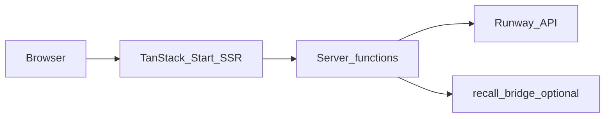

## Stack summary

| Layer | Technology |
|--------|------------|
| UI | React 19, Radix UI, Motion, Tailwind CSS v4, Phosphor Icons |
| App framework | TanStack Router, TanStack Query, **TanStack Start** |
| Bundler | Vite 7 |
| Types | TypeScript (strict), **Zod** on server function inputs |
| Production edge | **Cloudflare Workers** via `@cloudflare/vite-plugin` + `wrangler.jsonc` |

The app is **not** a classic “SPA + separate REST API” for most features: **server functions** (`createServerFn` from `@tanstack/react-start`) run alongside the UI and call Runway with secrets that never ship to the browser.

## Request flow

1. **Browser** loads React tree; TanStack Start handles SSR where configured.
2. **Server functions** validate input (Zod or custom validators), read **`process.env`**, then call Runway or the recall bridge.
3. **Runway** executes async generation tasks or provisions **realtime_sessions** for Characters.

## Why fetch for some Runway calls

The repo uses both:

- **`@runwayml/sdk`** — where appropriate for REST shapes the SDK covers cleanly.
- **Direct `fetch` to `getRunwayApiBase()`** — in [`runway-characters.ts`](https://github.com/Bleyle823/Brainway/blob/main/Brainway/src/lib/runway-characters.ts) and related modules for **Cloudflare Workers compatibility** and precise header control (`X-Runway-Version`).

Avoid confusing **`getRunwayApiBase()`** (origin + `/v1`, for raw REST) with **`getRunwayApiOrigin()`** (origin only, for SDK construction). Passing the full `/v1` base into the SDK can produce **`/v1/v1/...`** URLs and **404** responses. See [Runway integration](/docs/runway-integration).

## API version header

Runway requests use a pinned API version constant (**`RUNWAY_API_VERSION`**, currently `2024-11-06` in [`runway-config.ts`](https://github.com/Bleyle823/Brainway/blob/main/Brainway/src/lib/runway-config.ts)). When Runway deprecates versions, update this in one place and regression-test transforms, image tasks, and Characters.

## Major server-function modules

| Module | Responsibility |
|--------|----------------|
| [`transform-fns.ts`](https://github.com/Bleyle823/Brainway/blob/main/Brainway/src/lib/transform-fns.ts) | Ephemeral uploads, `gen4_aleph` video-to-video, safe image/audio helpers |
| [`character-fns.ts`](https://github.com/Bleyle823/Brainway/blob/main/Brainway/src/lib/character-fns.ts) | Create Characters sessions for `/live` + UI; applies personality for **custom** avatars |
| [`recall-meet-fns.ts`](https://github.com/Bleyle823/Brainway/blob/main/Brainway/src/lib/recall-meet-fns.ts) | Proxy **start / status / stop / mute** to `recall-bridge`; forwards `X-Runway-Key` + `X-Runway-Base-Url` |
| [`neurosafe-fns.ts`](https://github.com/Bleyle823/Brainway/blob/main/Brainway/src/lib/neurosafe-fns.ts) | Community library list/publish with in-memory store |

## Auth and tenancy (today)

The open-source app is oriented toward **single-org / bring-your-own-key** deployments: **no built-in end-user auth** is required to exercise server functions in development, but **production** deployments should add **auth, tenancy, and audit** if you expose the app beyond trusted testers. See [Security & privacy](/docs/security-privacy).

## Related docs

- [Routes & features](/docs/brainway-routes)
- [Neurodiversity profiles](/docs/neurodiversity-profiles)
- [Deployment](/docs/deployment)
