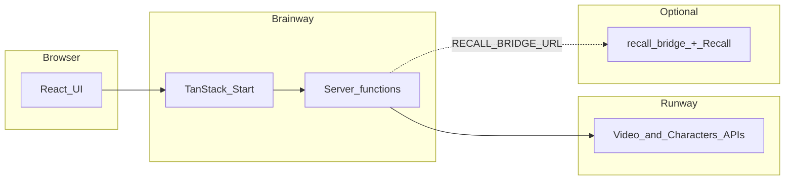

Brainway is **sensory-aware learning media for neurodivergent learners**. The product is an open **monorepo** that combines:

- **[Runway](https://runwayml.com)** generative **video** APIs and realtime **Characters** (`gwm1_avatars`).
- **Profile-based accessibility** presets (ADHD, autism, dyslexia, sensory) that shape both **prompts** and **UI** configuration.
- **Optional [Recall.ai](https://www.recall.ai/)** integration so a Character can join **Zoom, Google Meet, or Microsoft Teams** via the separate **`recall-bridge`** Node service.

The main user-facing application lives in [`Brainway/`](https://github.com/Bleyle823/Brainway/tree/main/Brainway) (TanStack Start + React + Vite). This Mintlify site deep-dives architecture, routes, environment variables, deployment, and limitations—beyond what fits in a single README.

## Who should read what

| You are… | Start here |
|-----------|------------|
| First-time visitor | This page, then [Repository layout](/docs/repository-layout) |
| Running the app locally | [Development workflow](/docs/development-workflow) |
| Integrating Runway or debugging API calls | [Runway integration](/docs/runway-integration), [Environment variables](/docs/environment-variables) |
| Building `/meet` or Recall flows | [Recall bridge](/docs/recall-bridge) |
| Deploying to production | [Deployment](/docs/deployment), [Troubleshooting](/docs/troubleshooting) |
| Handling student data / conferencing compliance | [Security & privacy](/docs/security-privacy) |
| Contributing code | [Contributing](/docs/contributing) |
| Evaluating claims about accessibility | [Research, claims, and limitations](/docs/research-limitations) |

## Mental model

- **Brainway** owns UI, routing, and most orchestration through **server functions** (`createServerFn`).
- **Runway** performs generation and realtime avatar sessions; the app sends an org **API secret** from the server only.
- **`recall-bridge`** is a **separate deployable**: Recall joins the meeting; the bridge serves **`bot.html`** and relays WebSocket video/audio so Runway Characters can appear as a participant.

## Key product surfaces (routes)

See [Routes & features](/docs/brainway-routes) for full detail. In short:

| Area | Route | Purpose |
|------|-------|---------|
| Marketing | `/` | Positioning, CTAs, live-meeting story |
| Transform studio | `/transform` | Video-to-video accessibility transforms (`gen4_aleph`) |
| Create | `/create` | Educator-oriented short video generation |
| Safe imagery | `/safe-images` | Sensory-conscious image prompts |
| Safe audio | `/safe-audio` | Ambient / masking / accessibility-oriented audio |
| Live Character | `/live` | Browser realtime session (`@runwayml/avatars-react`) |
| Conference bot | `/meet` | Send Character to Zoom/Meet/Teams via Recall |
| Community | `/community` | Neurosafe library UX (seeded / in-memory unless extended) |

## Honest scope

Many design choices reflect **cognitive-load** and **ND-inclusive** design literature, but **outcomes are not guaranteed** for every learner. Generative models can **hallucinate** or drift from teaching intent—**human review** remains essential. This software is **not** a medical device and **does not replace** formal accessibility processes, IEP/504 workflows, or professional judgement. Read [Research, claims, and limitations](/docs/research-limitations).

## Mintlify maintenance

- Site configuration: [`docs.json`](https://github.com/Bleyle823/Brainway/blob/main/docs.json) at the **repository root** (path to `docs.json` is the Mintlify project root).
- MDX pages live in [`docs/`](https://github.com/Bleyle823/Brainway/tree/main/docs).
- Assistant-only guidance: [`.mintlify/Assistant.md`](https://github.com/Bleyle823/Brainway/blob/main/.mintlify/Assistant.md) (not published on the docs site).
